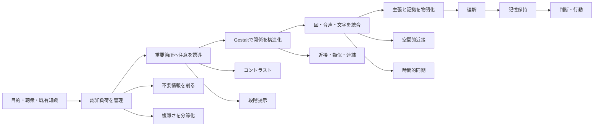
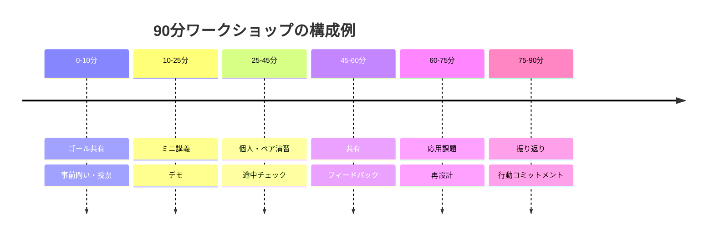

# 分かりやすいスライド作成の科学と実践ガイド

> **同梱時の変換について。** 本ファイルは Skill の設計仕様が「ドメイン知識の正本」と定めたガイドを、配布物へ同梱するために整形したものである。本文の文章は変更していない。変更したのは次の 3 点だけ。(1) 元原稿にあった機械可読でない引用マーカーを、末尾の参考文献に対応する `[著者 年]` 形式の出典表記へ置き換えた。対応先を特定できなかったマーカーは `[出典未特定]` と記した。(2) 節の見出しに番号を付した (§1〜§7)。各 Context はこの番号で参照する。(3) 末尾に出典表記の対応表を付録として追加した。
>
> 根拠レベル (§1 の表: A 直接的実験研究 / B 基礎認知・HCI・可視化研究 / C 公式ガイド / D 実務ヒューリスティック) を崩さずに読むこと。D の目安を必須ルールや科学的閾値として扱わない。

## 1. エグゼクティブサマリ

「分かりやすいスライド」は、単に文字を減らしたり、見た目を整えたりしたものではない。研究知見を総合すると、**聞き手が「どこを見るべきか」「何が重要か」「それが何を意味するか」を、限られた認知資源のなかで迷わず処理できるように設計された情報環境**と捉えるのが適切である。認知負荷理論では、作業記憶の容量に限界があるため、学習に不要な処理を削減し、複雑さを段階化することが重要とされる。Mayer のマルチメディア学習研究も、不要情報の削減、重要部分へのシグナリング、関連する文字と図の近接、音声と映像の時間的同期などを支持している。[van Merriënboer & Sweller 2010; Mayer, Cambridge Handbook]

本調査から導ける要点は次のとおりである。

- **「1枚1テーマ」より「1枚1主張」**と考える。見出しを「売上推移」のようなトピック名ではなく、「Q2売上は前年比18%増、新規顧客が成長を牽引」のような結論文にし、その下に視覚的証拠を置く。110名の工学系学生を対象とした assertion–evidence 型スライドの研究では、一般的な topic–subtopic／箇条書き型より、理解、誤概念、知覚された認知負荷、遅延再生で優位性が報告されている。[Garner & Alley 2013]
- **情報量を減らす目的は「簡素に見せること」ではなく、不要な認知処理を除くこと**である。装飾、重複テキスト、過剰な凡例、関係のない画像、過剰な色を削り、意味のある図・データ・因果関係に画面資源を使う。Mayer の coherence、signaling、redundancy、spatial/temporal contiguity の各原理がこの考え方を支える。[Mayer, Cambridge Handbook]
- **ナレーションとスライドに同じ仕事をさせない。** 話者は因果、意味、判断、ストーリーを説明し、スライドは構造、比較、位置関係、証拠を可視化する。長文を表示して同じ内容を読み上げることは原則として避ける。一方、字幕はアクセシビリティ上の必要性があるため、「冗長性原理」を理由に一律に排除してはならない。[Mayer, Cambridge Handbook; Microsoft PowerPoint アクセシビリティガイド]
- **アニメーションは「少ないほどよい」ではなく「意味がある時だけ使う」。** 2026年に日本の大学生40名を対象として行われた研究では、図の要素をナレーションに合わせて段階的に表示する cumulative presentation は、最初から全要素を表示する条件より学習成績が高く（Cohen's *d*=0.49）、音声に関連する要素への注視が早く（*d*=1.76）、長く（*d*=1.15）なった。装飾的な移動・回転ではなく、**分節化と音声同期**に使うべきである。[Ito & Ichikawa 2026]
- **グラフでは、重要な量を人が正確に読み取れる視覚変数に割り当てる。** Cleveland & McGill の古典的な実験では、共通尺度上の位置、位置、長さの判断が、角度・面積・体積・色などより正確であることが示されている。このため、精密比較なら円グラフよりドットプロットや棒グラフを優先する合理性がある。[Cleveland & McGill]
- **アクセシビリティは「特別対応」ではなく、通常の可読性設計として組み込む。** WCAG 2.2 は通常文字で4.5:1以上のコントラストを基準とし、Microsoft PowerPoint は18 pt以上のサンセリフ体、十分な余白、一意のスライドタイトル、代替テキスト、適切な読み上げ順、字幕などを推奨している。日本のデジタル庁デザインシステムも、テキスト4.5:1、非テキスト要素3:1、アクセント色の過剰使用回避を規定している。[Microsoft PowerPoint アクセシビリティガイド; デジタル庁デザインシステム; W3C WCAG 2.2]
- **「10分で注意が切れる」「必ず1分1枚」「6×6ルール」といった固定値を科学的法則として扱わない。** とくに「講義開始10～15分で注意が急落する」という有名な主張には、レビューで十分な根拠がないと指摘されている。枚数や切替頻度は、内容の複雑さ、話者、聴衆、表示環境で決め、リハーサルと実測で調整するのが妥当である。[Wilson & Korn 2007]

本報告では、根拠の性質を次のように区別する。

| 根拠レベル | 意味 | 本報告での代表例 |
|---|---|---|
| **A：直接的実験研究** | スライド／講義形式そのものを比較 | assertion–evidence、段階提示、オンライン講義中の小テスト。[Garner & Alley 2013; Ito & Ichikawa 2026; Szpunar, Khan & Schacter 2013] |
| **B：基礎認知・HCI・可視化研究** | スライド以外にも一般化可能な認知原理 | 認知負荷、Mayer、Gestalt、複数資源、グラフ知覚。[van Merriënboer & Sweller 2010; Mayer, Cambridge Handbook; Wagemans et al. 2012; Wickens 2008; Cleveland & McGill] |
| **C：公式ガイド** | アクセシビリティ・実装基準 | Microsoft、Google Material、W3C、デジタル庁。[Microsoft PowerPoint アクセシビリティガイド; デジタル庁デザインシステム; W3C WCAG 2.2; Google Material Design] |
| **D：実務ヒューリスティック** | 経験則。状況依存で検証が必要 | 枚数、具体的なpt数、進行時間配分。日本語の実務レビューなどを初期値に用いる。[平賀 2025; 「スライド発表のしかた」2025] |

## 2. 理論とエビデンスの統合モデル

分かりやすいスライドを設計する際には、一つの理論だけを適用するより、**認知負荷 → 注意誘導 → 知覚的グルーピング → マルチメディア統合 → 物語化 → 記憶・行動**という連鎖で考えると実務に落とし込みやすい。



この図は認知負荷理論、Mayer のマルチメディア原理、Gestalt の知覚的群化、注意資源研究を、本報告用に統合した設計モデルである。[van Merriënboer & Sweller 2010; Mayer, Cambridge Handbook; Wagemans et al. 2012; Wickens 2008]

**認知負荷理論。** van Merriënboer と Sweller のレビューでは、作業記憶は限定的で、長期記憶に蓄えられたスキーマが複雑な課題処理を支えるとされる。一般的な分類では、課題自体の複雑さに由来する intrinsic load、学習に不要な処理による extraneous load、学習に資する処理に関連する germane load が区別される。スライドに置き換えると、「難しい内容そのもの」をゼロにはできないが、**不要な枠、ロゴ、文章、凡例、重複説明、突然のレイアウト変更などの外在的負荷は設計者が削れる**。また初学者と専門家で適切な情報量が異なる expertise reversal effect に注意する必要がある。[van Merriënboer & Sweller 2010]

したがって「情報量は常に少ないほどよい」という理解も正確ではない。専門家向け学会発表では軸、誤差、条件、サンプル数などの情報が必要になる一方、初学者向けワークショップでは前提説明や中間ステップが増える。重要なのは、**意思決定や理解に必要な情報は残し、処理だけを要求する情報を減らすこと**である。[van Merriënboer & Sweller 2010; Kosslyn et al. 2012]

**Mayer のマルチメディア学習理論。** 実務上とくに重要なのは次の原理である。Coherence は不要な語・画像・音を除く、Signaling は重要部分を視覚的に示す、Redundancy は音声と同一の文章を不必要に重ねない、Spatial contiguity は対応する文字と図を近く置く、Temporal contiguity は関連する音声と映像を同時期に提示する、Segmenting は複雑な内容を処理可能な単位に分ける、という考え方である。[Mayer, Cambridge Handbook]

2026年の Ito & Ichikawa の研究は、とくに Segmenting と Temporal contiguity をPowerPoint上で直接検証した点で実務的重要性が高い。全体を最初から見せるのではなく、**説明対象となる要素だけをその瞬間に出し、最終的には全体像を完成させる**設計が、視線誘導と学習成績を改善した。したがって「アニメーション禁止」は科学的には粗すぎるルールであり、「**説明と同期して意味のある要素を段階的に出すアニメーションは推奨、装飾目的は原則不要**」とする方がエビデンスに整合する。[Ito & Ichikawa 2026]

**注意資源。** Wickens の multiple resource theory は、人の注意資源を単一の「容量タンク」とみなすのではなく、処理段階やモダリティなどによって干渉の程度が異なるとする。したがって「目はスライド、耳は話者だから同時に大量処理できる」とは考えない方がよい。同じ意味内容について、長文を読む、話を聞く、図との対応を探すという複数処理を同時要求すれば、内容理解に使える資源を圧迫しうる。[Wickens 2008; Mayer, Cambridge Handbook]

また「注意持続時間は10分」という固定的ルールには十分な支持がない。Wilson & Korn のレビューは、10～15分で一律に注意が落ちるという通説の根拠が弱く、個人差や講義内容の影響が大きいと結論づけている。一方でオンライン講義では mind wandering が学習を損なうことがあり、Szpunar らの21分のオンライン講義実験では、約5.5分のセグメント間に検索テストを挿入した群で mind wandering が減り、ノート取得と最終成績が向上した。ただし研究者自身も最適なテスト頻度は今後の検討課題としている。したがって「5分ごとに必ずクイズ」ではなく、**数分～十数分単位で意味のある認知的リセットを設計し、実測して調整する**のが妥当である。[Wilson & Korn 2007; Szpunar, Khan & Schacter 2013]

**Gestalt 原理と視覚階層。** Wagemans らのレビューでは、近接、類似、共通運命、対称性、連続性、閉合などの古典的原理に加え、共通領域や連結などの群化原理が整理されている。スライドでは、同じグループの説明と図を近く置く、同じ役割は同じ書式にする、無関係な要素間に十分な空間を置くことで、枠線や説明文を増やさず関係を伝えられる。[Wagemans et al. 2012]

日本語の実務研究でも、整列・反復・近接・コントラストと余白を重視し、凡例を離して置くより対応するデータの近くへ直接ラベルを置く例が紹介されている。2025年の『臨床神経学』の記事は、端的に「**スライド1枚あたりの情報量を少なくする**」ことを基本原則の一つとしている。医療学会向けの記事ではあるものの、認知心理学の空間的近接原理やGestalt原理との整合性が高く、一般のビジネス／学術スライドにも転用可能である。[平賀 2025]

**情報可視化。** Cleveland & McGill の実験研究では、数量比較の知覚精度には差があり、共通尺度上の位置が最も読み取りやすく、長さも比較的正確であるのに対して、角度、面積、体積、色相等は精密な数量比較に向きにくいとされた。したがって「AとBの差が何%か」を伝える場面では、円グラフやバブルより、共通軸上の棒／点の方が目的に合う。色は主に**カテゴリ区別、強調、状態**へ使い、精密な量そのものを色だけで符号化しない方がよい。[Cleveland & McGill]

**ストーリーテリング。** 「必ず起承転結」「必ず三幕構成」といった特定の物語テンプレートが、あらゆる学術・ビジネスプレゼンで最適だという強い直接証拠は乏しい。一方、Segel & Heer の Narrative Visualization 研究は、可視化ストーリーを、作者が進行を強く導く author-driven な側面と、受け手が探索する reader-driven な側面のバランスとして整理している。講演では前者を強くし、ワークショップでは最初にガイドした後で参加者が探索できるようにする、という使い分けが理論的に妥当である。[Segel & Heer 2010]

実務上は、物語を文学的にするより、次の因果チェーンを守る方が再現性が高い。

> **問い → なぜ重要か → 現状／証拠 → 何が分かったか → だから何をするか**

特に研究・データ発表では assertion–evidence 型、すなわち「**主張を見出しに置き、画面をその主張の証拠として使う**」構造が、このチェーンを1枚単位に落とし込む方法として有効である。[Garner & Alley 2013]

## 3. スライド設計の実践指針

設計の順序は、**内容 → 主張 → 証拠 → レイアウト → 装飾**とする。最初にテンプレートや配色から始めると、伝える内容ではなく「空いている枠を埋める」方向へ設計が引っ張られやすい。PowerPointの一般的な topic–subtopic／箇条書き構造より、主張と証拠を中心とする構造の方が理解を高めた研究があるため、テンプレートは「タイトル＋箇条書き欄」ではなく「主張＋証拠領域」を基本にするとよい。[Garner & Alley 2013]

| 要素 | 推奨する初期値・方法 | 避けたい設計 | 根拠 |
|---|---|---|---|
| **見出し** | 原則として1文のメッセージ。「売上推移」ではなく「Q2売上は18%増、新規顧客が牽引」 | トピック名だけで結論が分からない | Assertion–evidence 研究。[Garner & Alley 2013] |
| **本文フォント** | 投影は24–32 pt程度から開始し、最遠席テストで調整。オンラインも24 pt前後以上を初期値にする | 画面を埋めるために文字を縮小 | Microsoft は18 pt以上をアクセシビリティ上の基準として推奨。日本の2025年総説は本文20–28 pt程度を実務例として示す。固定的な科学的最適値ではない。[Microsoft PowerPoint アクセシビリティガイド; 「スライド発表のしかた」2025] |
| **書体** | 日本語は視認性の高いゴシック／サンセリフ系を基本候補にし、1～2書体に統一 | 装飾書体、細すぎるウェイト、多数書体の混在 | Microsoft は大きめのサンセリフを推奨。日本語のJ-STAGE実務論文も視認性と一貫性を重視。[Microsoft PowerPoint アクセシビリティガイド; 平賀 2025] |
| **色** | 基本は無彩色＋主色＋アクセント色程度。アクセントは「重要なものだけ」 | 全カテゴリを派手な別色、虹色、意味のない色変化 | デジタル庁はアクセント色の多用を避けることを推奨。日本のスライド論文も白黒灰＋メイン／アクセントの限定を提案。[デジタル庁デザインシステム; 平賀 2025] |
| **コントラスト** | 通常文字4.5:1以上を最低基準、重要文字はさらに余裕を持たせる | 薄い灰色文字、黄色／白など | WCAG 2.2、デジタル庁、Google Material。[デジタル庁デザインシステム; W3C WCAG 2.2; Google Material Design] |
| **レイアウト** | 余白、整列、近接で関係を示す。16:9を一般的な初期値にし、会場仕様を優先 | 全スペースを埋める、要素ごとに箱で囲む | 日本語J-STAGE論文は整列・反復・近接・コントラスト、余白、現在の一般的な16:9を推奨。[平賀 2025] |
| **情報密度** | 1枚につき「受け手に残したい主張」を1つ。その証拠だけを置く | 1枚に複数の結論、報告書のページをそのまま貼る | Mayer の coherence、CLT、AE研究。[van Merriënboer & Sweller 2010; Mayer, Cambridge Handbook; Garner & Alley 2013] |
| **図表** | 精密比較は位置／長さ。凡例より直接ラベル。結論部分だけ強調 | 3D、装飾グラフ、離れた凡例、色だけの識別 | Cleveland–McGill、J-STAGE日本語実例。[Cleveland & McGill; 平賀 2025] |
| **アニメーション** | 段階提示、時間変化、因果プロセス、注目誘導に限定 | 飛び込み、回転、バウンドなど情報的意味のない動き | 2026年段階提示実験、Kosslynらの心理学的分析。[Ito & Ichikawa 2026; Kosslyn et al. 2012] |
| **音声との分担** | スライド＝証拠・構造、話者＝意味・解釈・因果 | 表示文章をそのまま朗読 | Mayer の redundancy/modality/contiguity。[Mayer, Cambridge Handbook] |
| **アクセシビリティ** | 一意のタイトル、alt text、読み上げ順、字幕、単純な表、色以外の符号 | 色だけで成否を示す、複雑な結合セル、無字幕動画 | Microsoft公式、WCAG、Google Material。[Microsoft PowerPoint アクセシビリティガイド; W3C WCAG 2.2; Google Material Design] |

ここで重要なのは、**24 pt、2色、1枚1主張などは目的ではなく、認知上の問題を避けるための初期値**だという点である。例えば1枚の地図や系統図に20個のラベルが必要なことはある。その場合に20枚へ機械的に分割するのではなく、全体像を残しながら現在説明中の部分だけを強調する方が、位置関係の理解を保てることがある。2026年の cumulative presentation 研究は、このような「全体を段階的に構築する」方法を支持する。[Ito & Ichikawa 2026]

**図表は「何を読み取らせるか」から逆算する。**

| 聴衆にしてほしい判断 | 第一候補 | 注意点 |
|---|---|---|
| AとBの大きさを精密比較 | 棒、ドットプロット | 共通のゼロ／尺度を可能な限り使う。[Cleveland & McGill] |
| 時系列の増減を見る | 折れ線 | 注目系列を強調し、他系列は抑える |
| 2変数の関係を見る | 散布図 | 回帰線等は目的がある時だけ |
| 構成比を比較 | 100%積み上げ棒等 | 複数カテゴリの精密比較では円グラフより位置比較を優先 |
| プロセスを説明 | フロー／段階図 | 説明順に progressive reveal |
| before/after | 同一尺度の並列図 | 軸やサイズを変えない |

数量知覚については共通尺度上の位置や長さが比較的正確であり、角度や面積は劣るため、円・バブルは「全体感」を示す用途と「精密比較」を分けて考えるべきである。[Cleveland & McGill]

**色は視覚階層を作る「希少資源」と考える。** 重要なものだけにアクセント色を使えば、視線を誘導できるが、ほぼすべてを別色にすると「どれも重要」になり階層が消える。デジタル庁もアクセントカラーは注意を引く目的で多用しないことを求めている。さらに色覚多様性を考え、赤／緑等の色差だけで意味を符号化せず、「▲」「✓」、線種、ラベル、位置などを併用する。[デジタル庁デザインシステム; 出典未特定]

**字幕と冗長性原理は区別する。** 学習実験上、「図＋音声＋同一全文テキスト」を常時提示することは不必要な処理を増やしうる一方、聴覚障害、第二言語話者、音を出せない視聴環境では字幕そのものがアクセス手段になる。したがってライブ登壇では「全文をスライド本文に置く」のではなく字幕機能を別レイヤーとして提供し、スライド本体はキーワードと視覚証拠に保つのがバランスのよい設計である。[Mayer, Cambridge Handbook; Microsoft PowerPoint アクセシビリティガイド]

## 4. ユースケース別の構成テンプレート

スライド枚数について、**科学的に普遍的な最適枚数は存在しない**と考えるべきである。日本の2025年の発表指南では初心者の実務目安として「1分1枚」がなお妥当とされるが、同時に枚数そのものより「1枚に1メッセージ」「図表を詰め込みすぎない」ことが重要とされている。以下の枚数は、一般的なビジネス／学術聴衆を想定した**リハーサル前の初期値**であり、実測で修正する前提である。[「スライド発表のしかた」2025]

| ユースケース | 想定時間 | スライド枚数の初期値 | 1枚あたりの情報量 | 基本テンプレート | 進行 |
|---|---:|---:|---|---|---|
| **ワークショップ・参加型** | 60–90分 | 約25–40フレーム。講義内容だけなら15–25程度、残りを活動説明・問い・振り返りに使う | 1概念または1活動。活動指示は「目的・手順・成果物・時間」を一画面で確認できる量 | `問い → ミニ解説 → 例 → 演習 → 共有 → 解説 → 応用` | 聞く時間を連続させず、検索・説明・制作を挟む |
| **学会・登壇** | 10–20分 | 10分なら約8–12、15分なら約10–16、20分なら約14–20＋バックアップ | 1主張＋1主要証拠 | `問い/ギャップ → 方法 → 主要結果 → 解釈 → 限界 → 結論` | 結果に最も時間を割く |
| **社内報告・意思決定** | 5–10分 | 3–10。役員向け5分なら3–5を第一候補 | 1意思決定、1KPI、1比較など | `結論 → 根拠 → 選択肢 → 推奨 → 求める決定` | Answer first |
| **オンライン配信** | 20–45分 | 15–35程度。画面更新は対面よりやや頻繁でもよいが、各画面は低密度 | 1視覚フォーカス。スマホ／小画面を考慮 | `目的 → 短いセグメント → チェック → 次セグメント → Q&A → 要約/CTA` | 数分～十数分ごとに意味のある参加機会を設け、実測で頻度調整 |

この表の枚数は研究で確定した閾値ではなく、1分1枚という日本の実務的出発点、1枚1メッセージ原則、認知負荷・分節化研究から構成した推奨初期値である。[「スライド発表のしかた」2025; van Merriënboer & Sweller 2010; Ito & Ichikawa 2026]

**ワークショップ。** 参加型では「説明スライド」を減らすだけでなく、活動そのものをスライド構造に組み込む。オンライン講義研究で、講義区間の間に検索テストを入れると mind wandering が減り、ノート取得と学習が改善したことから、「聞く→思い出す→使う」を繰り返す設計には実証的根拠がある。ただし約5.5分という実験上の区切りを普遍的ルールにするべきではない。[Szpunar, Khan & Schacter 2013]



ワークショップでは Segel & Heer がいう author-driven な導入から reader-driven／participant-driven な探索へ移る構造が適する。最初に見方を教え、その後で自分でデータや課題を探索させる構造である。[Segel & Heer 2010]

活動スライドのテンプレートは、例えば次のようにする。

> **見出し：3分で「このスライドの結論」を1文にしてください**  
> 目的：主張と証拠を分離する  
> 手順：個人1分 → ペア比較1分 → 修正1分  
> 成果物：30字以内の見出し  
> 残り時間：3:00

これなら進行中に口頭指示を聞き逃しても、参加者が自律的に再開できる。活動指示を明示し、参加者が内容を能動的に検索・説明する構造は、オンライン講義中の検索実践で得られた知見とも方向性が一致する。[Szpunar, Khan & Schacter 2013]

**学会／登壇。** 研究発表では「背景を全部話して最後に結論」より、聴衆が何を判断すべきかを早く示す。日本の2025年総説も、研究発表ではIMRADを基礎としながら、結論から逆算して構成を考えることを推奨している。[「スライド発表のしかた」2025]

実務テンプレートは次の通りである。

| スライド | メッセージ例 |
|---|---|
| 問い | 「Xを改善してもYが改善しないのはなぜか？」 |
| ギャップ | 「従来研究はAを測定していない」 |
| 仮説／目的 | 「Bが媒介すると予測した」 |
| 方法 | 「この比較ならBだけを切り分けられる」 |
| 主要結果 | 「B条件でのみYが改善した」 |
| 結果 | 「効果はサブグループCで最大だった」 |
| 解釈 | 「原因はDである可能性が高い」 |
| 限界 | 「ただしEには一般化できない」 |
| 結論 | 「実務ではFを優先すべき」 |

各スライドを assertion–evidence にすると、「結果」という見出しではなく「介入群ではエラー率が32%低下した」のように結論自体をタイトルへ置ける。これは audience comprehension の比較研究で支持されている。[Garner & Alley 2013]

**社内報告。** 意思決定者向けでは「経緯を順番に説明する」より、先に回答を出す。

> **Recommendation**  
> 来期はA案を採用する  
>
> **Why**  
> 利益率 +4pt / 導入期間 −2か月 / 最大リスクは移行負荷  
>
> **Decision needed today**  
> 予算2,000万円の承認

ここでは「ストーリー性」より**decision traceability、すなわち結論と証拠の対応の明瞭さ**を優先する。タイトルを結論文にして証拠を視覚化する assertion–evidence は、この用途にも適用しやすい。[Garner & Alley 2013]

資料を事前・事後に単独閲覧させる場合は、話者がいないため少し情報量を増やしてよい。ただし「登壇用スライドを報告書化する」のではなく、発表用と配布用を分ける方がよい。発表版は話者との協働を前提とし、配布版では注記、出典、補足説明を増やす。この違いは Mayer のモダリティ／冗長性原理が前提とする「音声が存在する学習環境」と整合する。[Mayer, Cambridge Handbook]

**オンライン配信。** 小さい画面、圧縮映像、マルチタスク環境を前提に、1画面の焦点をさらに絞る。20～45分を一本の連続講義にせず、短いセグメントと問い、投票、チャット、検索テストを挟む設計が有力である。Szpunar らの実験では21分のオンライン講義を4セグメントに分け、途中テスト群で mind wandering と学習に改善がみられた。[Szpunar, Khan & Schacter 2013]

オンラインでは字幕の価値も大きい。Microsoft はPowerPointのアクセシビリティ対応として字幕／キャプション、代替テキスト、読み上げ順、一意のタイトルなどを挙げている。録画を後日配布する場合は、字幕またはトランスクリプトと、スライド単体でも検索できる意味のあるタイトルを残すことが望ましい。[Microsoft PowerPoint アクセシビリティガイド]

## 5. 評価指標と検証方法

「見やすいと思ったか」だけでは、スライドの有効性を評価できない。Kosslyn らの研究では、心理学的原則への違反が様々な領域のPowerPointで頻繁に観察され、さらに観察者が必ずしも個々の違反を正確に見抜けないことも示された。したがってデザイナーの主観評価だけでなく、**理解・記憶・注意・行動を測る**必要がある。[Kosslyn et al. 2012]

| 評価対象 | 主指標 | 測定例 | 適したタイミング |
|---|---|---|---|
| **理解** | 正答率、推論問題、説明の質 | 5～10問の直後テスト。「資料に書かれていたか」ではなく因果・比較を問う | 発表直後 |
| **記憶保持** | delayed recall / recognition | 同等難度の並行問題、要点の自由再生 | 1日～1週間後 |
| **注意** | mind-wandering、注視時間、time-to-first-fixation | ランダムthought probe、eye tracking | 発表中 |
| **認知負荷** | mental effort／難しさの主観評価 | 短い評定尺度 | 各セグメント後 |
| **行動変容** | 実行率、判断精度、完了時間 | 推奨手順の利用、提案採用、タスク成功率 | 数日～数週間後 |
| **アクセシビリティ** | 到達可能性・エラー | Accessibility Checker、字幕精度、キーボード／読み上げ順確認 | 公開前 |
| **満足度** | 好ましさ、信頼感 | アンケート | 補助指標として直後 |

理解・遅延再生・認知負荷を組み合わせた評価は assertion–evidence 研究で、事前／事後テストと eye tracking は2026年の cumulative presentation 研究で、mind-wandering probe はオンライン講義研究で実際に用いられている。[Garner & Alley 2013; Ito & Ichikawa 2026; Szpunar, Khan & Schacter 2013]

**推奨するA/B実験例**は次のようになる。


ここで最も重要なのは、**スライド以外を可能な限り同じにすること**である。話者、台本、時間、情報内容まで変えると「デザインの効果」なのか「説明の効果」なのか分離できない。Garner & Alley の研究も、同じ題材に対し異なるスライド構造を比較することで構造の影響を検討している。[Garner & Alley 2013]

実験条件の例は以下である。

| 条件A：現行 | 条件B：改善 |
|---|---|
| トピックタイトル | assertion headline |
| 箇条書き中心 | 図＋直接ラベル |
| 全要素を一括表示 | ナレーション同期の段階表示 |
| 6色 | 無彩色＋主色＋アクセント |
| 凡例を右側 | データへ直接ラベル |
| 本文18–20 pt | 実環境で読めるサイズへ拡大 |
| 説明文を読み上げ | 音声は因果・解釈を担当 |

この比較は、AE研究、Mayer の原理、2026年段階提示実験、Gestalt／日本語実務論文を同時に検証できる形になっている。[Garner & Alley 2013; Mayer, Cambridge Handbook; Ito & Ichikawa 2026; 平賀 2025]

ただし、複数の改善を一度に入れると「改善パッケージとして効いたか」は測れるが、どの変更が効いたかは分からない。原因を特定したい場合は、例えば「一括提示 vs 段階提示」だけを変える、または `見出し × 表示方法` の2×2要因計画にする。2026年研究はまさに表示タイミングを主な操作対象とし、視線と学習結果を組み合わせてメカニズムまで検討している。[Ito & Ichikawa 2026]

**注意を測る際、視線＝理解とみなしてはいけない。** Eye tracking は「どこを、どれくらい、どのタイミングで見たか」を測れるが、その内容を正しく理解したかは別にテストする必要がある。Ito & Ichikawa の研究が eye tracking と retention test を併用しているのはこの意味で重要である。[Ito & Ichikawa 2026]

オンラインで eye tracker が使えない場合は、thought probe、セグメントごとの1問クイズ、回答率、離脱率などを代理指標として使える。ただし離脱率のようなログは「注意」そのものの直接測定ではないため、理解テストと組み合わせるべきである。オンライン講義実験では mind-wandering の自己報告と学習成績を別々に測定している。[Szpunar, Khan & Schacter 2013]

**行動変容**については、発表の目的から逆算して指標を決めるのがよい。営業研修なら「新しい質問フレームの使用率」、社内提案なら「意思決定に要した時間と判断精度」、安全研修なら「手順遵守率」、ワークショップなら「翌週に実際に改善したスライド数」などである。満足度が高くても実行されなければ、行動目的のプレゼンとしての成功とは別問題になるため、反応指標と成果指標を分けて扱う。

統計的には「有意差の有無」だけでなく、**効果量と信頼区間**を記録し、可能なら事前に「どの程度の改善なら実務的に価値があるか」を定め、その最小効果に基づき標本数を設計するのが望ましい。2026年の段階提示研究が *d*=0.49、視線指標でより大きな効果量を報告しているように、同じ介入でもアウトカムによって効果の大きさは異なる。[Ito & Ichikawa 2026]

## 6. 実例分析とビフォー／アフター

日本語の具体例として有用なのが、2025年『臨床神経学』の「経験した症例をまとめる：わかりやすく効果的なスライドの作り方」である。同稿は「悪い例／改善例」を実際に対比し、情報削減、フォント統一、色数制限、整列・反復・近接・コントラスト、余白、直接ラベルなどを示している。症例発表向けではあるが、そこで扱われる問題の多くは一般的なビジネススライドにも共通する。[平賀 2025]

| 観点 | 悪いスライド | 良いスライド | なぜ改善するか |
|---|---|---|---|
| タイトル | 「2026年度売上について」 | 「Q2売上は前年比18%増、新規顧客が牽引」 | 最初に主張を形成できる。AE研究と整合。[Garner & Alley 2013] |
| 本文 | 7～10個の長い箇条書き | 図＋2～3個の短い注釈 | 不要処理を減らし、図と語を統合。[Mayer, Cambridge Handbook] |
| グラフ | 円グラフ＋離れた凡例 | 棒／ドット＋直接ラベル | 共通尺度の位置・長さを利用し、視線移動も減らす。[Cleveland & McGill; 平賀 2025] |
| 色 | 6～8色が同じ強さ | 無彩色＋1つのアクセント | 視覚階層を明確化。[デジタル庁デザインシステム] |
| 配置 | 要素ごとに箱、位置がばらばら | 関連項目を近接・整列 | Gestaltの群化を使える。[Wagemans et al. 2012] |
| アニメーション | 文字が飛ぶ、回転する | 説明対象のみ順番に表示 | 注意を関連要素へ誘導。[Ito & Ichikawa 2026; Kosslyn et al. 2012] |
| 話者 | 画面の文章を朗読 | 「なぜ」「だから何か」を説明 | 音声と視覚の役割を分担。[Mayer, Cambridge Handbook] |
| アクセシビリティ | 赤／緑だけで成否を示す | 色＋ラベル＋形、十分なコントラスト | 色覚多様性、低視力への対応。[デジタル庁デザインシステム; 出典未特定] |

たとえば、典型的な「悪い社内スライド」は次のようになる。

```text
売上実績について

・2026年度第2四半期の売上高は前年同期と比較して18%増加した
・新規顧客からの売上が増えた
・既存顧客についても若干増加傾向である
・関東地方で大きく伸びた
・新商品の販売も順調である
・マーケティング施策の効果が考えられる
・今後も引き続き推移を注視する必要がある

[6色の円グラフ]      [凡例]
```

問題は「文字数が多い」ことだけではない。**結論を探す、文章を読む、凡例と色を照合する、話者を聞く、重要部分を判断する**という処理が同時に要求される。これは CLT、spatial contiguity、signaling、グラフ知覚の観点から改善余地が大きい。[van Merriënboer & Sweller 2010; Mayer, Cambridge Handbook; Cleveland & McGill]

改善案は次のようにする。

```text
Q2売上は前年比 +18%
成長の 72% は新規顧客が寄与

        売上指数
120 ┤                         ● 118  ← Q2
110 ┤                  ●
100 ┤           ● 100
 90 ┤
    └──────────────────
        前年Q2      Q1       Q2

      +18%
        ↑
  新規顧客 +13pt
  既存顧客  +5pt

次の判断：新規獲得施策をQ3も継続する
```

ここでは見出しが結論、グラフが証拠、アクセントは「+18%」「新規顧客」に限定され、話者は「なぜ新規が伸びたか」「Q3で再現可能か」を説明する。Assertion–evidence、直接ラベル、共通尺度、視覚階層、ナレーション分担を一つのスライドに統合した例である。[Garner & Alley 2013; Cleveland & McGill; 平賀 2025; Mayer, Cambridge Handbook]

変換プロセスは次のように一般化できる。


この変換は、assertion–evidence、Mayer の coherence/signaling/contiguity、Gestalt、段階提示研究を組み合わせた実務フローである。[Garner & Alley 2013; Mayer, Cambridge Handbook; Wagemans et al. 2012; Ito & Ichikawa 2026]

さらに、**悪いスライドを「綺麗にする」だけでは不足する**。例えば7つの箇条書きを、アイコン7個に置き換えても情報構造が変わっていなければ、認知上の仕事はほぼ残る。先に「このスライドで受け手に何を理解／判断してほしいか」を一文にし、その主張に不要な要素を消すことが優先である。Kosslyn らの分析も、装飾ではなく relevance、discriminability、perceptual organization など心理学的原理に基づいてスライドを評価する必要性を示している。[Kosslyn et al. 2012]

## 7. 実践チェックリストと主要参考文献

最終レビューでは、デザインの美しさではなく、次の順番で確認するとよい。

| チェック | 合格条件 |
|---|---|
| **目的** | この発表後に、聴衆が「知る／判断する／行動する」内容を1文で言える |
| **ストーリー** | 各スライドの見出しだけ読んでも、主張の流れがおおむね理解できる |
| **1枚の役割** | 各スライドに主要主張が原則1つ |
| **証拠** | 主張に対応する図、数値、例が画面上に存在する |
| **削除** | 結論に寄与しないロゴ、装飾、文章、画像を削除した |
| **視覚階層** | 3秒見た時に、最重要要素がどれか分かる |
| **近接** | ラベルと対象、説明と図が物理的に近い |
| **色** | 強調色が本当に重要な箇所だけに使われている |
| **コントラスト** | 少なくとも4.5:1を意識し、投影／配信環境でも判読可能 |
| **図表** | 精密比較を円・面積・3Dに頼っていない |
| **凡例** | 可能ならデータへ直接ラベルを置いた |
| **アニメーション** | 「この動きで何の理解が改善するか」を説明できる |
| **ナレーション** | スライド本文をそのまま読み上げていない |
| **字幕・alt** | 字幕、代替テキスト、一意のタイトル、読み上げ順を確認した |
| **実機テスト** | 最遠席または小型端末で実際に確認した |
| **時間** | スライド枚数ではなく実際のリハーサル時間で調整した |
| **学習確認** | ワークショップ／研修では、説明の後に思い出す・使う機会がある |
| **検証** | 満足度だけでなく理解、保持、注意、必要なら行動を測定する |

チェックリストの理論的基礎は、認知負荷理論、Mayer、Gestalt、assertion–evidence、アクセシビリティ指針、2026年の段階提示実験にある。[van Merriënboer & Sweller 2010; Mayer, Cambridge Handbook; Wagemans et al. 2012; Garner & Alley 2013; Microsoft PowerPoint アクセシビリティガイド; Ito & Ichikawa 2026]

特に「迷ったときの優先順位」は次のようにすると一貫する。

> **理解 > アクセシビリティ > 正確性 > 視線誘導 > 美観 > 装飾**

美しいスライドと分かりやすいスライドは両立するが、美観を上げるために情報構造やコントラストを犠牲にしてはならない。Kosslyn らの研究が示すように、スライド品質は好みだけではなく、人間の知覚・記憶・理解に関する原理で評価可能である。[Kosslyn et al. 2012]

**主要な学術・一次資料。** 認知負荷理論については van Merriënboer & Sweller, “Cognitive load theory in health professional education: design principles and strategies,” *Medical Education* 44(1), 2010 が、限られた作業記憶、スキーマ、負荷管理、expertise reversal をまとめている。[van Merriënboer & Sweller 2010] Mayer のマルチメディア原理については *The Cambridge Handbook of Multimedia Learning* の coherence、signaling、redundancy、spatial contiguity、temporal contiguity を扱う章が中心的資料である。[Mayer, Cambridge Handbook]

プレゼンテーション固有の直接研究としては、Garner & Alley, “How the design of presentation slides affects audience comprehension: A case for the assertion-evidence approach,” *International Journal of Engineering Education* 29(6), 2013 が重要で、110名の工学系学生を対象に assertion–evidence 型の理解・保持上の利点を報告している。[Garner & Alley 2013] Kosslyn et al., “PowerPoint Presentation Flaws and Failures: A Psychological Analysis,” *Frontiers in Psychology* 3, 2012 は、知覚・記憶・理解の心理学的原理から実際のPowerPointの問題を分析した研究である。[Kosslyn et al. 2012]

最新の直接的エビデンスとしては、Ito & Ichikawa, “Cumulative Presentation Enhances Learning Outcomes by Directing Learners' Visual Attention,” *Journal of Computer Assisted Learning* 42, 2026 が、段階提示と音声同期を眼球運動と学習テストの双方から検証している。日本の大学生を対象にした研究であり、日本語環境での研修・教育スライドにとって特に参考価値が高い。[Ito & Ichikawa 2026]

注意については Wickens, “Multiple Resources and Mental Workload,” *Human Factors* 50(3), 2008 が複数資源モデルを整理している。[Wickens 2008] 「10～15分注意持続説」を検証した Wilson & Korn, “Attention During Lectures: Beyond Ten Minutes,” *Teaching of Psychology* 34(2), 2007 は、この固定値を支持する研究が乏しいことを示している。[Wilson & Korn 2007] オンライン講義では Szpunar, Khan & Schacter, “Interpolated memory tests reduce mind wandering and improve learning of online lectures,” *PNAS* 110(16), 2013 が、途中の検索テストと注意・学習の関係を実験的に検討している。[Szpunar, Khan & Schacter 2013]

視覚組織化では Wagemans et al., “A Century of Gestalt Psychology in Visual Perception,” *Psychological Bulletin* 138, 2012 が、近接、類似、連続性、閉合、共通領域、連結などを包括的にレビューしている。[Wagemans et al. 2012] 情報可視化では Cleveland & McGill の graphical perception 研究が、位置、長さ、角度、面積等の知覚精度を実験的に比較した基礎研究として重要である。[Cleveland & McGill] ストーリーテリング／可視化では Segel & Heer, “Narrative Visualization: Telling Stories with Data,” *IEEE Transactions on Visualization and Computer Graphics* 16(6), 2010 が author-driven と reader-driven の設計空間を整理している。[Segel & Heer 2010]

**日本語の実務資料。** 平賀陽之「経験した症例をまとめる：わかりやすく効果的なスライドの作り方」『臨床神経学』65巻6号, 2025 は、悪い／良いスライドを実際に対比しながら、情報削減、フォント、色、整列、反復、近接、コントラスト、余白、図表、アニメーションを説明しており、日本語資料として特に実践性が高い。[平賀 2025] 2025年の「スライド発表のしかた」も、1分1枚を初心者向けの目安として扱いつつ、1枚1メッセージ、フォントサイズ、色数、アニメーション等を整理している。[「スライド発表のしかた」2025]

**公式デザイン／アクセシビリティ資料。** Microsoft のPowerPointアクセシビリティガイドは、一意のタイトル、18 pt以上のサンセリフ、余白、alt text、読み上げ順、字幕、単純な表、Accessibility Checkerを具体的に解説している。[Microsoft PowerPoint アクセシビリティガイド] デジタル庁デザインシステムは日本語で色とコントラストを体系化し、テキスト4.5:1、非テキスト3:1、アクセント色の限定使用等を示す。[デジタル庁デザインシステム] W3C WCAG 2.2 は4.5:1等の基準の原典であり、Google Material Design も十分なコントラスト、明確な階層、簡素なレイアウトをアクセシビリティ原則として採用している。[W3C WCAG 2.2; Google Material Design]

総括すれば、最も再現性の高い設計ルールは「**文字を何文字以下にするか**」ではなく、次の問いである。

> **この1枚で、聴衆は何に注意し、何を理解し、何を覚え、次に何をすべきなのか。**

その答えが画面上で一意になるよう、**主張を見出しにし、証拠を可視化し、不要情報を除き、関連要素を近接させ、必要な部分だけをナレーションと同期して提示し、アクセシビリティを確保する。** 現時点の認知心理学、プレゼンテーション研究、情報可視化研究、公式アクセシビリティガイドを横断すると、これが最も堅牢な「分かりやすいスライド」の方法論である。[van Merriënboer & Sweller 2010; Mayer, Cambridge Handbook; Garner & Alley 2013; Ito & Ichikawa 2026; Microsoft PowerPoint アクセシビリティガイド]

## 付録. 出典表記の対応表 (同梱時に追加)

本文中の `[…]` は次の文献・資料を指す。書誌の詳細は §7 の「主要な学術・一次資料」「日本語の実務資料」「公式デザイン／アクセシビリティ資料」にある。

| 出典表記 | 文献・資料 | 根拠レベル |
|---|---|---|
| [van Merriënboer & Sweller 2010] | van Merriënboer & Sweller, "Cognitive load theory in health professional education: design principles and strategies," *Medical Education* 44(1), 2010 | B |
| [Mayer, Cambridge Handbook] | *The Cambridge Handbook of Multimedia Learning* の coherence / signaling / redundancy / spatial contiguity / temporal contiguity を扱う章 | B |
| [Garner & Alley 2013] | Garner & Alley, "How the design of presentation slides affects audience comprehension: A case for the assertion-evidence approach," *International Journal of Engineering Education* 29(6), 2013 | A |
| [Kosslyn et al. 2012] | Kosslyn et al., "PowerPoint Presentation Flaws and Failures: A Psychological Analysis," *Frontiers in Psychology* 3, 2012 | B |
| [Ito & Ichikawa 2026] | Ito & Ichikawa, "Cumulative Presentation Enhances Learning Outcomes by Directing Learners' Visual Attention," *Journal of Computer Assisted Learning* 42, 2026 | A |
| [Wickens 2008] | Wickens, "Multiple Resources and Mental Workload," *Human Factors* 50(3), 2008 | B |
| [Wilson & Korn 2007] | Wilson & Korn, "Attention During Lectures: Beyond Ten Minutes," *Teaching of Psychology* 34(2), 2007 | B |
| [Szpunar, Khan & Schacter 2013] | Szpunar, Khan & Schacter, "Interpolated memory tests reduce mind wandering and improve learning of online lectures," *PNAS* 110(16), 2013 | A |
| [Wagemans et al. 2012] | Wagemans et al., "A Century of Gestalt Psychology in Visual Perception," *Psychological Bulletin* 138, 2012 | B |
| [Cleveland & McGill] | Cleveland & McGill の graphical perception 研究 (位置・長さ・角度・面積等の知覚精度の実験比較) | B |
| [Segel & Heer 2010] | Segel & Heer, "Narrative Visualization: Telling Stories with Data," *IEEE TVCG* 16(6), 2010 | B |
| [平賀 2025] | 平賀陽之「経験した症例をまとめる：わかりやすく効果的なスライドの作り方」『臨床神経学』65(6), 2025 | D |
| [「スライド発表のしかた」2025] | 2025 年の「スライド発表のしかた」(1 分 1 枚を初心者向けの目安として扱う日本語の発表指南) | D |
| [Microsoft PowerPoint アクセシビリティガイド] | Microsoft の PowerPoint アクセシビリティガイド (一意のタイトル、18 pt 以上のサンセリフ、alt text、読み上げ順、字幕、Accessibility Checker) | C |
| [デジタル庁デザインシステム] | デジタル庁デザインシステム (テキスト 4.5:1、非テキスト 3:1、アクセント色の限定使用) | C |
| [W3C WCAG 2.2] | W3C Web Content Accessibility Guidelines 2.2 (4.5:1 等の基準の原典) | C |
| [Google Material Design] | Google Material Design のアクセシビリティ原則 (十分なコントラスト、明確な階層、簡素なレイアウト) | C |
| [出典未特定] | 元原稿の引用マーカーに対応する資料を §7 の一覧から特定できなかったもの。色覚多様性に関する箇所で [デジタル庁デザインシステム] と併記されている | — |
